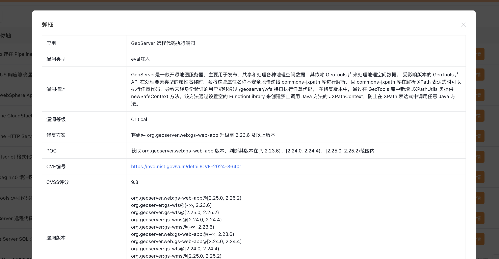
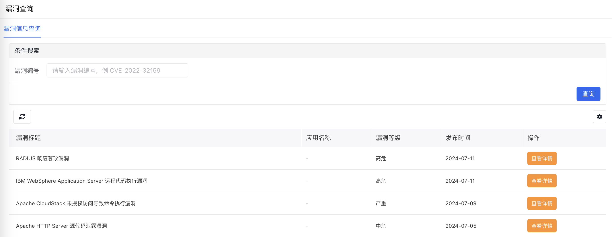
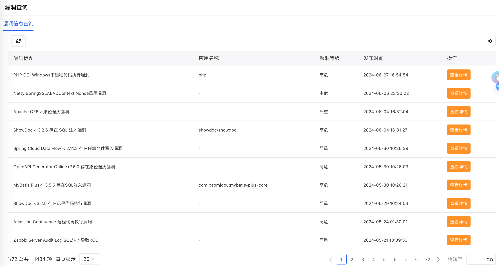

# bug_search
一款免费开源的漏洞情报系统

# 基于python3 + Amis2.9 开发
仅依赖Flask,requests，Amis是百度开源的低代码前端框架
# 漏洞情报包含：组件漏洞 + 软件漏洞 + 系统漏洞

# docker-compose部署方式（推荐）
1. git clone https://github.com/menglike/bug_search && cd bug_search
2. docker-compose up -d

# docker部署方式（推荐）
1. git clone https://github.com/menglike/bug_search && cd bug_search && docker build -t  bug_search:v2 .
2. docker run --name bugsearch2 -p 7777:7777 -d bug_search:v2

# 源码部署方式：
1 下载源码，配置python依赖,可以国内镜像源 
2 启动服务： python main.py runserver --reload，默认端口7777 
3 当然也可以选择supervisor进行部署，根据实际情况自行部署 

访问地址：http://localhost:7777/ 或者 http://localhost:7777/index 
页面预览：
  

更新日志： 

2024.10.28 发布v2.2 
1.已经增加了Dockerfile，可以自行完成镜像的构建 
2.优化了部分页面样式
 

2024.7.18 发布v2.1 
1. 增加了搜索
2. 优化了页面样式
   
   
 

2024.6.10 发布v2 
1.更新了 数据源
页面预览：
  
 

------------------------------------------------
如果这个项目对您有帮助，请我喝一杯瑞幸！ 
   

TODO: 1.提供Docker-compose部署方式 
      2.增加邮件发送消息报警功能
